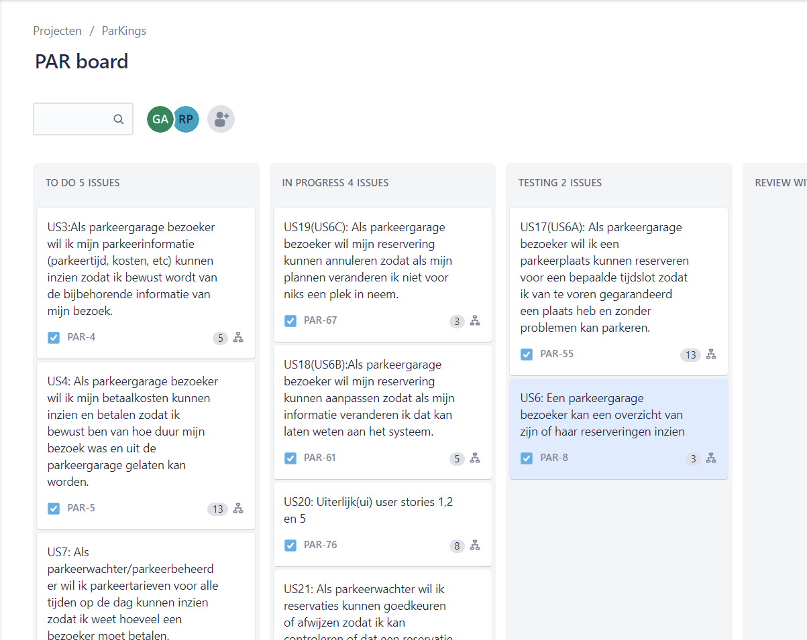
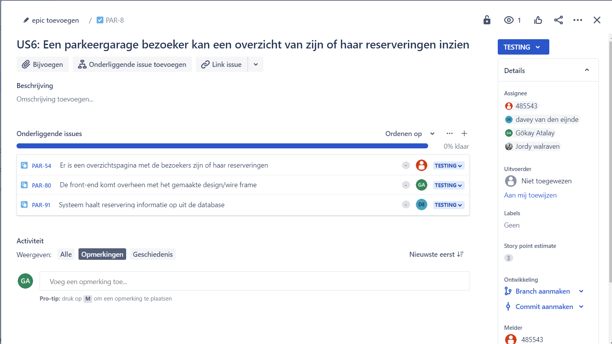

# Agile Working

## What is Agile?

Agile is a way of working on a project following a set of ideals and practices. It works by centering itself around "incremental and iterative" steps to work towards a complete project. These steps are carried out in short cycles. This helps with team collaboration, quick delivery and encourages constant feedback.

## Agile Methods

Because Agile is a set of practices and not a method itself, many different methods were born. Here follows a list of some examples:

-   Scrum
-   Kanban
-   Extreme Programming (XP)
-   Lean Development
-   Feature-driven development (FDD)
-   Crystal

## Agile Practices

Agile is supported by a list of practices to help with development, some practices are listed below:

-   Agile testing
-   Backlogs
-   Daily stand-up
-   Retrospective
-   Test-driven development (TDD)
-   User story

## Agile Method used during Group Project

For the group project we decided to use Scrum, as some teammembers already had experience with Scrum and it's the most used method. It will be a huge plus to be able to work using the Scrum method. 

Listed below is the workflow used in Scrum and the one we applied to our development-process.

### Sprint

When working with Scrum, the length of your sprints is discussed at the beginning. Sprints are short periods of between one and four weeks. A part of the project is focused on during the sprint and is delivered at the end of the sprint to receive immediate feedback. This helps with keeping a constant stream of communication with other stakeholders open.

### Daily Scrum (standup)

Every day during a sprint, the team comes together and holds a meeting no longer than (around) fifteen minutes. This short meeting is designed to help keep the team up-to-date with the progress of the project. The standup can also be used to bring the team's attention to potential issues that can arise during development, however, no discussions regarding how to fix these issues should take place. Certain developers can discuss such matters after the standup.

### Sprint review

At the end of the sprint the team presents their finished work to the stakeholders. They give a demo showing the product and explaining what they've worked on. The stakeholders can use this opportunity to ask questions and/or give feedback. 

If there is uncompleted work that can be discussed with the stakeholders and the impact that will be having. Although uncomplete work should not be presented during the sprint review's demo.

Together with the stakeholders, the team can discuss what to work on during the next sprint. Our team gives a proposal, and is often met with a counter-proposal. If the counter-proposal is realistic we'll agree on which tasks/userstories to work on.

### Sprint retrospective

During the sprint retrospective the team looks back at the sprint and dicusses how it went. This can be about certain individuals, the way the team works together, use of tools, or any other subject that might need to be refined.

You should not only focus on the negative, what went wrong, but also on positives, stuff that went well. You should talk about the things that went well that helped with the development of the product. Highlighting this can help the team recognize the value a certain component brings, so that it may continue in the following sprints to come.

It should be discussed during the retrospective if something went wrong. Not to shame the team, but to, again, recognize components that may have caused a halt or slow in development. This can help the team learn from previous mistakes, so that they won't happen again in the future. These should not be personal attacks, but suggestions on how to handle certain situations.

Maybe you recognize something that can be done differently during the next sprint. A teammember might know of something to introduce into the workflow of the team, if it may improve the development-process. These ideas may be brought forward and discussed with the team.

## Scrumboard

With the team we used a scrumboard to keep track of all items that needed to be worked on. The OPs recommended we use [Jira](https://www.atlassian.com/software/jira). We placed our userstories in the board and gave each userstory an estimation of how much effort it is going to take, a.k.a. storypoints.

After dividing the work between teammembers, we assigned stories to teammembers in Jira so we could track who is responsible for what task. We could also track with items were not being worked on, in progress, being tested and done.

Each userstory has been divided into subtasks which can be registered under a productbacklog in Jira. If a userstory has enough tasks for multiple people to work on them, you can assign a person to a specific task. That way multiple people can be working on one userstory if it's necessary. Each subtask can be assigned it's own status on whether it's done or not. That allows the team to see what part of what userstory is or isn't finished.

## Sources
- [What is Agile? - Atlassian](https://www.atlassian.com/agile)
- [Agile 101 - Agile Alliance](https://www.agilealliance.org/agile101/)
- [What Is Agile? And When to Use It - Coursera](https://www.coursera.org/articles/what-is-agile-a-beginners-guide)
- [What is scrum? - Atlassian](https://www.atlassian.com/agile/scrum)
- [What is Scrum? - Scrum.org](https://www.scrum.org/resources/what-is-scrum)
