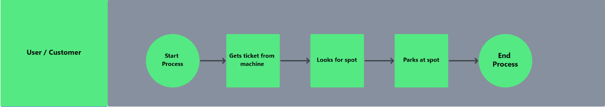
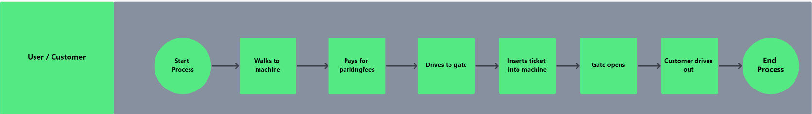
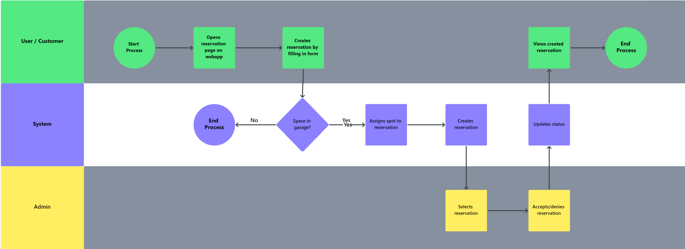
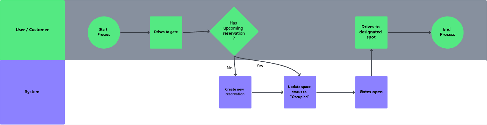
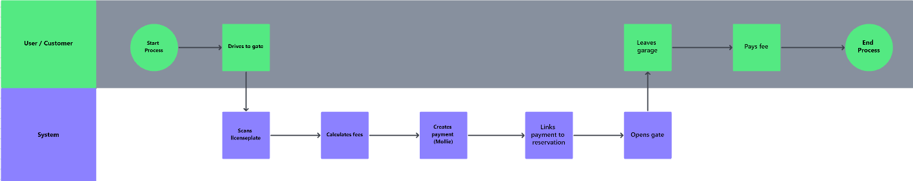

# Business Process

## What is a business process?

A business process is a collection of tasks and activities that together provide either a service or a product for the customer/client. These can be visualized through diagrams like flowcharts to show the individual steps a process will take to reach the destination. A business process will start as a goal or a problem that needs to be solved and will end as a final product or process that eliminates that problem. There might also be different actors involved in a process like this in which each actor will have his/her/it's own responsibilities.

## Business processes in software (engineering)

Software has become very important in busincess processes, because without software, these processes might take many people, a lot of time and resources to complete. Using software these processes can be automated, making them much faster, effective and require less resources. 

## Examples Parkings

For our groupproject we worked on an application for parkinggarages which people can use to reserve spots, enter the garage, pay their fees and more. I looked at the process without an application like this and compared it to the process after an app like this would be implemented. To visualize the processes I made some diagrams.

### Process of entering garage without the app

Below you can see the process of entering a garage without the app visualized. It explains how the person gets a ticket from a machine, which opens the gate. After that the person drives inside to look for a spot.

### Process of leaving garage without the app

This one is a bit longer as it contains more steps. When the person would like to leave the garage, he or she needs to go to a machine with their ticket. They can then insert the ticket into the machine to pay their fees. When that is done they can drive to the gate where they will need to insert the ticket into the machine, which checks whether the fees are paid. The gate then opens and the person can leave the garage.

### Process of creating a reservation with the app

With our app the user can create a reservation for a spot before even going to the garage. This way he or she can guarantee that they have a spot when entering the garage.

As you can see there are three actors in this process. The user begins the process but after filling in a simple form the system performs some checks and actions to save the reservation in a database. After that an admin (which we have nicknamed Betty, being forced to handle the reservations in a dark basement somewhere) will either accept or deny a reservation which will update it's status.

### Process of entering garage with the app

With our app we eliminate the need to give the person a ticket when wanting to enter the garage. A scanner will be placed at the entrance and will scan the licenseplates to see whether they have a reservation or not. If they don't the system will create one but without a departuretime and will update it when the person leaves. The status of the parkingspot will be changed to "Occupied" and the gates will open.

### Process of leaving garage with the app

Our app eliminates the process of having to pay at a machine there and having to insert the ticket before the gates open. One can just get in their car and leave and and the scanner will scan the licenseplate number to determine for how long someone has parked and calculate the fees based on that. A payment will be created and linked to the reservation. The person can then pay the fees after having arrived home.

## Sources
-   https://www.educative.io/answers/what-is-a-business-process-in-software-engineering
-   https://www.tutorialspoint.com/software_testing_dictionary/business_process.htm

Justice for Betty ✊