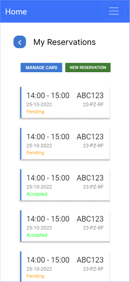
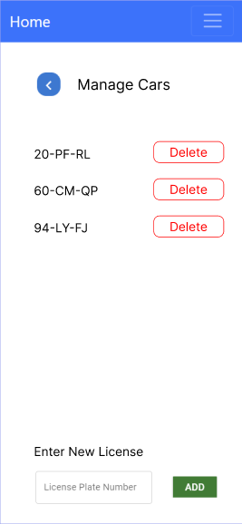
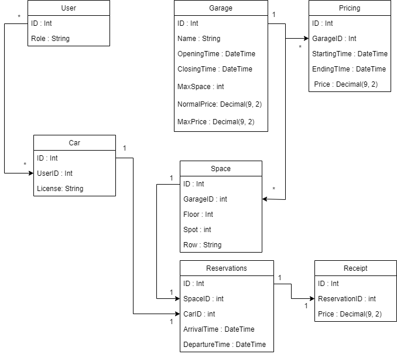
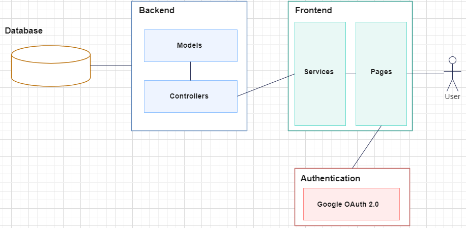
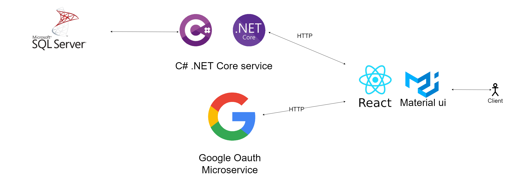

# System Design - Parking Garage App

For the company Mediaan we were given two projects to choose from. They gave short presentations about both and told us in short what kind of applications they both were. One of them was a restaurant app, the other was a parking garage app. After a short talk with the team we decided to just vote, and whichever app got the most votes was the project we were going to on. Parking garage won the vote.

## Frontend designs

There are some things that need to be designed and thought about before an app can be developed. One of the most important things (, because it is what's immediately seen) is the frontend. You can have all the logic in the world, but if there is no design to back it up, it looks like you have very little working.

We made some frontend designs for some of the screens we were going to need. We sent them off to the POs and implemented their feedback.

 

## ERD Diagram

Another important part of the application is the database. All of the data is going to be stored there so it needs to be designed well so development can go smoothly. We started with a diagram, and constantly made small changes based on new findings to make the database work better.

We have a bunch of tables working together that are connected with relations. We had to think about what data needs to be saved, and what data can be calculated inside of the application. This database model has also been placed in migration files so that teammembers can generate the database below by typing one command into their IDE.

 

## Architecture Design

We had to decide on the architecture of the application. We could either create a monolith application, in which the frontend and backend are combined into one project or go for a distributed architecture, the same one we learnt about during our individual projects. 

Eventually we decided to go for a distributed architecture, to apply the knowledge from our individual projects and practice with new techniques.

For authentication we decided to use a seperate service which stands seperate from the rest of our application. Using Google's authentication seemed to be the safest option for our project.

## Techstack

Just as important, is the techstack. We could either go for a language/framework which was new to us, or play it safe and choose for one everyone had experience with. It seemed smarter to play it a bit safe in case the project would challenge us enough. We wouldn't want to place more obstacles in front of us unnecessarily.

The techstack we went for comprises of:

-   Frontend framework: React.
-   Component library (frontend): Material UI & Bootstrap React.
-   Backend framework: ASP.Net Core.
-   Database: Microsoft SQL Server.

Although not everyone was fluent in React, it would help making the UI a bit easier. The component libraries allowed us to focus more on the API and logic instead of having to style every component ourselves, thus saving us alot of time.

