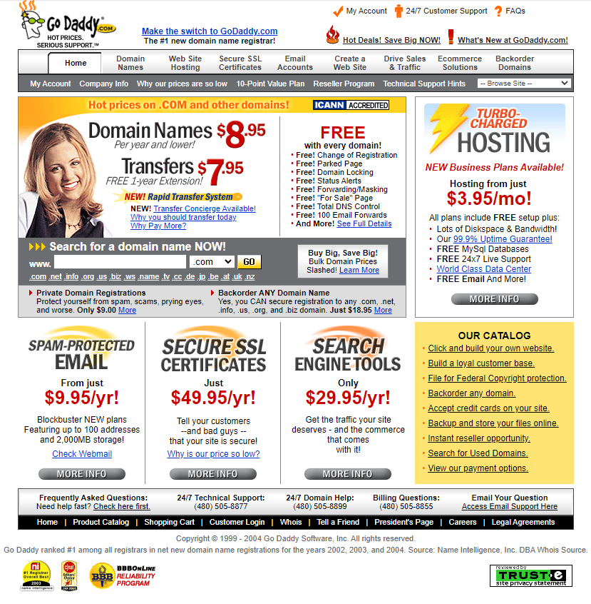
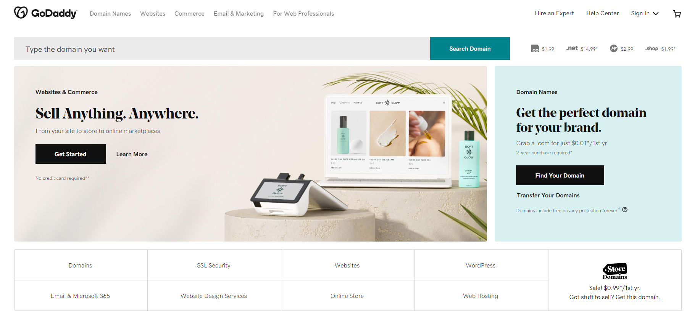

# How to determine the quality of the UX for my project?

## Usability

There are 5 components when it comes to usability. 
-   Efficiency: A user can quickly find and complete a task.
-   Learnability: First time users of your app can easily understand navigation and functions.
-   Memorability: After a user hasn’t used your app in a while, how quick can they refamiliarize themselves with the app?
-   Errors: What errors do users make, how often do they make these and how severe are they?
-   Satisfaction: How pleased are users when using the interface?

There are other key features that contribute to an interface with high usability. A user needs to be able to perform the task at hand easily, without any outside expert help. 

A feature worth looking into is `Aesthetic and Minimalist design`. This feature says that dialogues and pages should not contain information that is irrelevant and not needed. It’s important to keep your design clean. You’ve probably heard the saying “Less is more”. Alot of websites today will have very minimal and uncluttered landing pages, that is not coincidence. The goal is to let the user know as fast as possible what that website or page is about and what it’s for. 

Let’s look at an example, let’s use [GoDaddy](https://www.godaddy.com/nl-nl). On the [WayBackMachine](https://archive.org/web/) we can go back in time to see what webpages looked in the past. 

Down below is an example from around 2009. As you can see the page is incredibly cluttered. It’s hard to understand what’s going on, because there’s too much on the screen. It takes too long to get all the information, because it throws everything at you at once.

 
 

Below is the GoDaddy site today. It’s a night and day difference. First thing you notice is that there’s less on the screen. A little bit of text you have to read, along with some pictures, and you already know what this website provides. It’s a lot cleaner, easier on the eyes and more aesthetically pleasing.

