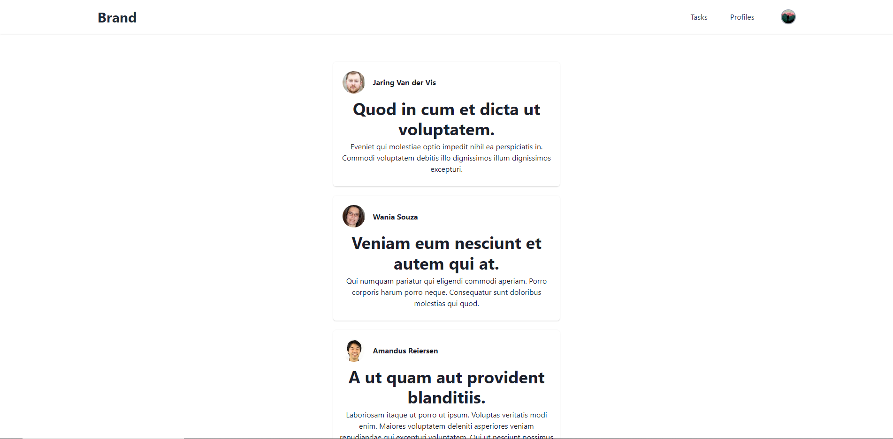

# How to determine the quality of the UX for my project?

## Responsive

Not every user views your webapp on the same type of device. You don’t know whether that’s going to be a desktop, laptop, Ipad, phone or smart fridge. All these devices have different screen sizes and so need to display the data differently to make up for the size difference.

When a site is not responsive, the contents are laid out the same for mobile as they would for desktop. That is obviously a problem, for desktop a layout might provide a clear overview, but that same layout is not going to work on mobile because, because there’s less space. To fix this the app should change the layout of the content if the screen is smaller.

Items that are laid out horizontally should be laid out vertically, with less margins to make up for less space on smaller devices.

In my application I render tasks in seperate cards, but those cards don't take in a lot of space when viewed on desktop. They have a width set that prevents it from stretching too much across the screen. But on mobile that width should be bigger, which is what I was able to achieve using Tailwind CSS.

As you can see there's a lot of space left and right of those cards. I experimented with different widths to see what looked most natural on screen and eventually came across this.
 
 

But on mobile I decided to shrink those empty spaces by increasing the width of the cards, since there's less room on mobile.