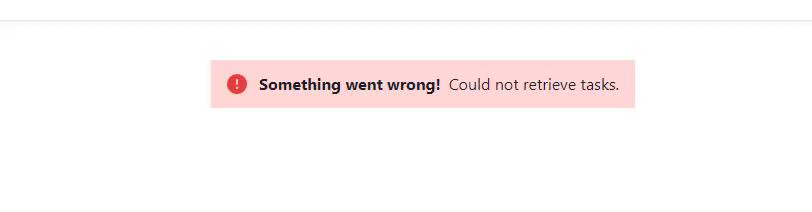

# How to determine the quality of the UX for my project?

## Functionality

Whenever a user visits your application, it should always be working as intended. If a potential customer visits your website to take a look at your service, but sees that the website is broken, he or she will instantly lose trust and have no faith in your product. All the components in it should be working so as to not scare someone away.

### Working links

Your application will be full of links that link to other pages or maybe even an external page. A user clicks on a link with an expectation to be directed somewhere. When that doesn’t happen a user can be left disappointed. Make sure the links in your code point to existing routes that can be defined in your app.

Navigation links take a url portion as an attribute which you can use to specify to which url the app should navigate.
```html
<a href="/tasks" className="px-3 py-2 mx-3 mt-2">Tasks</a>
```

That piece of url should be registered as a route to show the user the correct page.

```javascript
<Routes>
    <Route path='/' element={<Home/>}/>
    <Route path='/login' element={<Login/>}/>
    <Route path='/tasks' element={<Tasks/>}/>
</Routes>
```

As you can see the path `/tasks` is registered in my `App.js` file, to point that path to a specific page, in this case `Tasks`.

That can be tested using, for example, React Testing Library. RTL is a library which you can use to test what the user sees. If you expect to be shown a specific page when being redirected somewhere, but that doesn’t happen, then the test will throw an error.

### Buttons

When a button is clicked it should run the operation succesfully and notify the user of said operation. If an operation fails for whatever reason, it should be handled in your code and shown to the user to let them know of the error that just occurred.


Above message is shown when something goes wrong fetching the data from the backend. The user is shown no specific data on the request or response, but is only shown a general message notifying them that an operation took place but failed.


Although above console message is shown whether or not you catch the error, this adds no value since a normal guest of your webapp has no idea this is being output. It's also not professional to just leave the message there and do nothing with it, and just leave the user to wonder what's happening because the screen stays on white.


Same goes for successful events. When a user successfully creates a task, the user should be notified if the operation goes well. Only redirecting them with no message still doesn't help the user fully understand the status of the operation. That's why when an operation is successful, a success message should be shown to inform the user of the status.

You can watch recordings of users clicking around on your website to see whether the links and operations work properly. You can use tools like [Crazy Egg](https://www.crazyegg.com/recordings?utm_source=google&utm_medium=blog) to create these recordings.

## Reliability

If you want users to keep coming back to your service/application, it has to be reliable. It has to be up and running and fast. Nobody is going to drive a car that keeps breaking down and stops working, after a while you just get annoyed and look for something else. Same goes for your website, pulling new users is one thing, keeping them is another, with the following points you can help your website/webapp keep the users that are already using it.

### Uptime

Something worse than an application with broken links and buttons, is an application that itself is broken, and down. A service that can’t be accessed might as well not exist. You want to guarantee that your application is 99.99% up to not disappoint customers. You could have the best web application but if the browser shows a “Can’t access” screen, then that would be a waste of effort.

But no matter how much effort you put into keeping your webapp online, things can always go wrong. In that case, you do want to be notified when your app goes down. You can use monitoring services to keep track of the state of your app. You can set them up to notify you when your app is down so you can start looking into the issue as soon as possible.

There are many tools that provide this service but one of them is [robot.alp](https://robotalp.com/en/website-monitoring). Robotalp seems easy to setup and has different kinds of monitoring.

### Fast loading

Before I get into fast loading, one thing you want to do is let the users know that your application is loading something in the first place. Not just a white screen in which nothing is happening, but some sort of icon to show that an operation is taking place. One way to do this is show a spinner while data is being fetched for example.



Everyone knows how annoying it is when a webpage loads for too long. If it takes too long a user might change their mind on using your application and might go elsewhere. You want to optimize your application to lower loading times. Best case scenario is if your application loads almost instantly when a resource is requested. That will provide a great user experience.

To achieve this one needs to get rid of unnecessary gunk in your code. For example fancy shmancy JavaScript code that barely adds any value. Or a resource that gets requested but is not used, will unnecessarily increase loading times and worsen the user experience.
